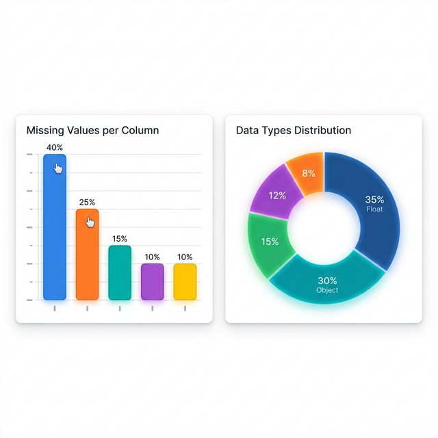
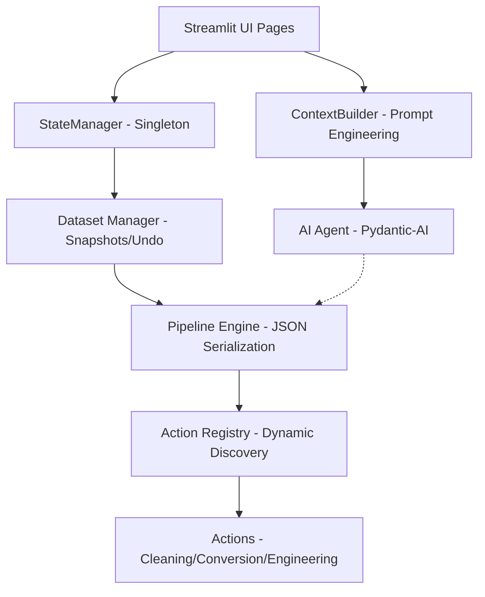

# 🧪 DataPrep Kit: AI-Powered Data Engineering Workspace

[](https://www.python.org/downloads/)
[](https://streamlit.io)
[](https://opensource.org/licenses/MIT)
[](https://github.com/hima12awny/dataprep-kit/graphs/commit-activity)

**DataPrep Kit** is a professional-grade, AI-augmented data preparation environment designed for data scientists, ML engineers, and analysts. It transforms the often-tedious "80% of data work" into a streamlined, interactive, and fully reproducible experience.



---

## 🌟 Why DataPrep Kit?

Existing tools often force a choice between low-code simplicity and the power of Python. **DataPrep Kit** bridges this gap by providing a sleek Streamlit interface over a robust, pandas-based execution engine, augmented by state-of-the-art LLMs.

### 🧠 AI-Augmented Reasoning
Unlike static toolkits, DataPrep Kit features a **Context-Aware AI Agent** layer powered by `pydantic-ai`.
- **Structured Outputs**: Agents don't just "talk"; they produce validated JSON schemas that the application can execute directly.
- **Deep Context**: Our `ContextBuilder` provides LLMs with a high-density "map" of your data, including statistical distributions, schema quality, and sample correlations.
- **Multi-Provider Support**: Switch seamlessly between **Gemini**, **OpenAI**, **Anthropic**, and **Groq**.

### 📜 The Pipeline Engine
Every action you take—from dropping a column to complex temporal engineering—is recorded in a **Portable JSON Pipeline**.
- **Replayability**: Run the same cleaning logic on new batches of data with one click.
- **Audit Trail**: Full history of changes with a 30-step **Undo/Redo** snapshot system.
- **Validation**: Each step is validated against the schema before execution to prevent pipeline breaks.

---

## 🛠️ Feature Deep-Dive

### 1. Data Profiling & Quality Analysis
- **Heuristic Type Detection**: Automatically identifies dates, booleans, and categorical data stored as strings.
- **Outlier Detection**: Uses IQR and Z-Score methods to flag statistical anomalies.
- **Missing Value Matrix**: Visualize sparsity and distribution of nulls across your dataset.

### 2. Intelligent Data Cleaning
- **Smart Imputation**: Fill missing values using mean, median, mode, or custom constant values, with optional group-by logic.
- **Text Normalization**: Batch apply regex-based cleaning, whitespace stripping, and case conversion.
- **Deduplication**: Intelligent row matching with subset-specific logic.

### 3. Advanced Feature Engineering
- **Temporal Ops**: Extract year, month, day, or calculate time-deltas from date columns.
- **Math & Logic**: Apply vectorized mathematical transformations or logic-based new columns.
- **Interaction Terms**: Create polynomial features or column combinations for better ML performance.

---

## 🏗️ Technical Architecture

DataPrep Kit is designed with separation of concerns at its core:



Detailed technical documentation can be found in the [**Developer Guide**](DEVELOPER_GUIDE.md).

---

## 🚦 Getting Started

### Prerequisites
- Python 3.9 or higher
- (Recommended) API Key for Groq, OpenAI, or Google Gemini

### Installation

1.  **Clone & Enter**:
    ```bash
    git clone https://github.com/hima12awny/dataprep-kit.git
    cd dataprep-kit
    ```

2.  **Environment Setup**:
    ```bash
    python -m venv venv
    source venv/bin/activate  # Windows: venv\Scripts\activate
    pip install -e .
    ```

3.  **Configuration**:
    Create a `.env` file in the root directory:
    ```env
    GROQ_API_KEY=your_key_here
    OPENAI_API_KEY=your_key_here
    GEMINI_API_KEY=your_key_here
    ```

### Running the App
```bash
streamlit run app.py
```

---

## 👨‍💻 Author & Contribution

**Ibrahim Awny**
- 📧 [hima12awny@gmail.com](mailto:hima12awny@gmail.com)
- 🔗 [LinkedIn: ibrahim-awny](https://www.linkedin.com/in/ibrahim-awny/)

### Contributing
We welcome contributions! Whether it's a new cleaning action or an improvement to the AI agent, feel free to open a PR. Please read the [Developer Guide](DEVELOPER_GUIDE.md) for architectural standards.

---
*Built with ❤️ for Data Engineers by Ibrahim Awny.*
